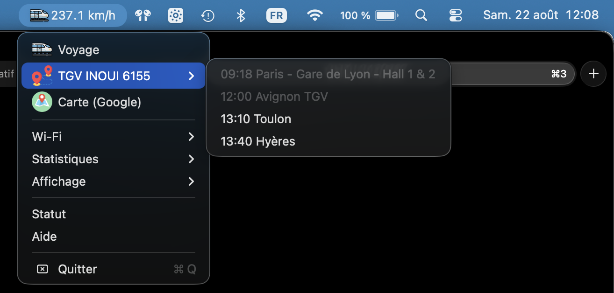

# TGVSpeed

Application native macOS affichant dans la barre de menus la vitesse du TGV,
le trajet et l'état de la connexion Wi-Fi de bord.

Réécriture en Swift/AppKit de [`tgvspeed`](https://github.com/rene-d/tgvspeed) (Python/rumps).



## Fonctionnement

Les données proviennent du routeur de bord, joignable uniquement depuis le réseau
`_SNCF_WIFI_INOUI` :

| Endpoint | Usage |
|---|---|
| `/router/api/train/gps` | position et vitesse — interrogé toutes les 2 s |
| `/router/api/train/details` | trajet et arrêts — toutes les 30 s |
| `/router/api/connection/status` | forfait de données — à l'ouverture du menu |
| `/router/api/connection/statistics` | qualité du lien et nombre d'appareils — idem |

Le mode nominal n'est toutefois pas le REST mais le **flux Socket.IO** du portail,
qui pousse la position à 1 Hz et quatre événements sans équivalent REST
(`connected_devices`, `data_consumption`, `bar_attendance`, `train_number`).
Le REST ci-dessus sert de **repli automatique** dès que le socket reste muet plus de
8 secondes — traversée de tunnel, perte de couverture — avec reconnexion en backoff.
Le transport utilisé est indiqué dans le menu *Statut*.

Le frontal nginx du portail ne relaie pas l'upgrade websocket, malgré ce qu'annonce
le handshake ; le portail lui-même s'épingle en `transports:["polling"]`.

Hors du train, l'application se met en veille : le sondage passe de 2 s à 20 s,
le titre se réduit à l'icône et les entrées de menu qui dépendent du réseau sont désactivées.

## Menu

- **Voyage** — ouvre le portail SNCF
- **TGV INOUI 6155 ▸** — les arrêts, heure réelle en tête ; les arrêts desservis sont grisés,
  les retards portent un badge et une infobulle avec le motif. **Cocher une gare** déclenche
  une notification avant l'arrivée — le délai se règle en pied de sous-menu,
  *Prévenir avant l'arrivée* (5 à 30 min, dix par défaut) ; ⌥ sur un arrêt ouvre sa fiche
  sur wifi.sncf
- **Carte (Google)** — la position courante dans Google Maps
- **Wi-Fi ▸** — données restantes, remise à zéro du forfait, qualité du lien, appareils
  connectés, file du bar ; le rendu brut des documents JSON est relégué dans un sous-menu
  *Détails techniques*, d'où *Exporter en JSON…* écrit les documents complets dans
  *Téléchargements* et les montre dans le Finder
- **Statistiques ▸** — vitesse max et moyenne, distance parcourue, altitude, cap, arrivée estimée
- **Affichage ▸** — contenu du titre, unité (km/h ou mph), icône monochrome, affichage du réseau
- **Statut** — le document GPS brut, copiable
- **Aide** — le dépôt

### Notification d'arrivée

Une seule gare à la fois. La coche apparaît en badge sur le sous-menu du trajet, pour
la retrouver sans l'ouvrir, et disparaît d'elle-même une fois la gare desservie ou le
train changé.

Le seuil est évalué en continu plutôt que programmé à l'avance : l'heure d'arrivée bouge
au fil des retards publiés, et une notification planifiée serait fausse dès la minute
suivante. C'est l'**horaire annoncé**, retard inclus, qui sert de référence — l'ETA
calculée à partir de la vitesse ignore le freinage en approche et annoncerait sept minutes
là où la fiche horaire en promet dix.

Le délai de prévenance se choisit sous *Prévenir avant l'arrivée*, au pied du sous-menu
du trajet : 5, 10, 15, 20, 25 ou 30 minutes. Le badge de l'entrée rappelle la valeur
courante, dix minutes par défaut. Le changer ne rejoue pas une notification déjà partie.

macOS demande l'autorisation d'afficher des notifications au premier cochage.

### Détails techniques et export

Le sous-menu *Détails techniques* rend les documents du routeur tels quels, mais en
écarte ce qui n'apprend rien sur la connexion : le tracé de la ligne (`trainGraph`,
des centaines de points) et la configuration du portail (`modulesConfiguration`, 851
lignes d'intentions de chatbot et de vignettes d'accueil). La liste est en tête de
`Sources/TGVSpeed/Menu/WiFiMenu.swift`, `excludedEvents` et `excludedKeys`.

*Exporter en JSON…*, en bas de ce sous-menu, écrit **tout** — statut, qualité et
événements Socket.IO, filtre compris — dans un fichier horodaté. C'est ce fichier qui
sert à décider quoi ajouter à la liste, ou à joindre une trace complète quand l'API
change.

### Réseau Wi-Fi

L'option *Afficher le réseau Wi-Fi* lit le SSID courant. macOS exige pour cela
l'autorisation **Localisation** : elle n'est demandée qu'à l'activation de l'option,
et l'application fonctionne entièrement sans.

## Installation

Télécharger l'image disque de la [dernière release][releases], l'ouvrir, glisser
**TGVSpeed** dans *Applications*, puis lever la mise en quarantaine :

```shell
xattr -dr com.apple.quarantine /Applications/TGVSpeed.app
```

L'application est signée en *ad hoc* et n'est pas notarisée — faute de compte Apple
Developer, non par négligence. Sans cette commande, macOS refuse de l'ouvrir en
annonçant qu'elle « n'a pas pu être vérifiée ». Un ⌃-clic sur l'application puis
*Ouvrir* aboutit au même résultat, en deux clics de plus.

L'image contient un binaire universel arm64 + x86_64 ; macOS 14 minimum.
Le fichier `.sha256` joint à la release permet de vérifier le téléchargement :

```shell
shasum -a 256 -c TGVSpeed-1.0.0.dmg.sha256
```

[releases]: https://github.com/rene-d/tgvspeed.app/releases/latest

## Compilation

```shell
make            # liste les cibles disponibles
make app        # produit TGVSpeed.app
make install    # copie dans /Applications
make universal  # binaire arm64 + x86_64
```

Aucune dépendance externe : Swift 6, AppKit, `URLSession`. macOS 14 minimum
(les badges de retard utilisent `NSMenuItemBadge`).

La signature est *ad hoc* par défaut ; pour une vraie identité :

```shell
make app CODESIGN_ID="Developer ID Application: …"
```

`make dmg` produit l'image disque distribuée ; `make universal dmg` la construit à
partir du binaire universel. C'est ce qu'exécute le workflow `.github/workflows/release.yml`,
déclenché par un tag `v*` : il joue `make check` contre le simulateur, construit,
vérifie les deux architectures et la signature, puis publie la release.

## Développement hors du train

`tgvsim` rejoue un trajet complet — position, vitesse, progression des arrêts, retards —
sur les mêmes routes que le routeur de bord.

```shell
make sim                                     # http://localhost:8000
make demo                                    # lance l'app branchée dessus
make check                                   # imprime le menu construit, sans interface
```

Options du simulateur :

```shell
swift run tgvsim --port 8000 --at 60 --speed 1
```

- `--at <min>` : minute du trajet où démarrer (60 = entre Bordeaux et Angoulême, ~200 km/h)
- `--speed <n>` : accélération du temps (`30` rejoue les 3 h 40 en 7 minutes)
- `--no-socket` : renvoie 404 sur `/socket.io/`, pour vérifier le repli REST

Le simulateur sert aussi le flux Socket.IO, aux mêmes cadences que la rame.
Pour l'observer :

```shell
./TGVSpeed.app/Contents/MacOS/TGVSpeed --socket-dump 25
```

La variable `TGVSPEED_BASE_URL` redirige l'application vers n'importe quelle base d'API.

## Particularités de l'API

Relevées à bord, elles ne sont documentées nulle part :

- il n'y a **pas de champ `carrier`** dans `/train/details` ; le libellé est composé
  en dur sous la forme `TGV INOUI <numéro>` ;
- le bloc `progress` d'un arrêt décrit le tronçon qui **part** de cet arrêt, pas celui
  qui y arrive : la distance restante jusqu'au prochain arrêt se lit donc sur l'arrêt
  précédent, et le terminus n'a pas de bloc `progress` du tout ;
- `consumed_data` et `remaining_data` sont en **kilo-octets** (leur somme vaut 1 024 000,
  soit le forfait de 1 Go), `granted_bandwidth` en **kbit/s** ;
- `quality` est une note **sur 5**, pas un pourcentage.

Les endpoints `connection/data_consumption` et `connection/connected_devices` n'existent
pas en REST (404) : ce sont uniquement des événements Socket.IO.

Voir `Fixtures/README.md` pour les captures.

### Savoir si l'API a changé

L'API ne porte **aucun numéro de version** : ni endpoint `/version`, ni en-tête, ni champ
dans les documents. À défaut, trois empreintes se relèvent en une commande et suffisent à
décider s'il faut tout réanalyser.

```shell
curl -s https://wifi.sncf/ | grep -oE '/assets/(js|styles)/[0-9a-f]{6}\.[a-z.]+'
curl -sI https://wifi.sncf/assets/js/281e3d.app.js | grep -i last-modified
curl -s 'https://wifi.sncf/socket.io/?EIO=4&transport=polling'
```

Valeurs relevées le 29 août 2026, à bord du TGV INOUI 6124 :

| Empreinte | Valeur | Ce qu'elle signale |
|---|---|---|
| bundles du portail | `/assets/js/281e3d.app.js`, `/assets/styles/546c6b.bundle.css` | l'empreinte est un hachage du contenu : elle change à chaque redéploiement du portail |
| `Last-Modified` des bundles | `Fri, 05 Jun 2026 10:09:10 GMT` | date de ce déploiement |
| handshake Engine.IO | `EIO=4`, `pingInterval:25000`, `pingTimeout:20000`, `maxPayload:1000000` | version du protocole et cadence des PING |

Un hachage inchangé signifie que le portail — donc le contrat que consomme
l'application — n'a pas bougé. S'il change, reprendre la procédure de
recapture décrite dans `CLAUDE.md`.
